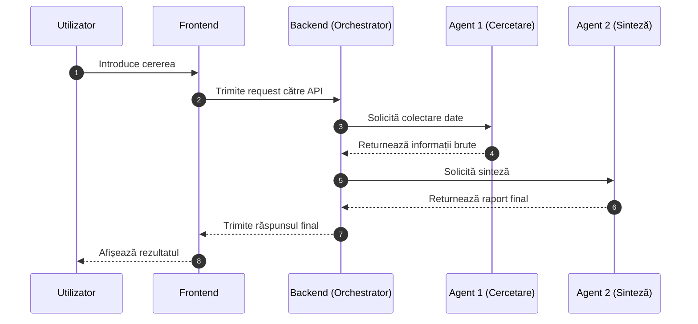

# 📐 System Architecture

## 🧱 UML Component Diagram

```plantuml
@startuml
actor Utilizator

package "Frontend Layer" {
  [Frontend]
}

package "Backend Layer" {
  [Backend (Orchestrator)]
}

package "Agent Layer" {
  [Agent 1 (Cercetare)]
  [Agent 2 (Sinteză)]
}

database "Local LLM (Ollama)" as LLM

Utilizator --> Frontend
Frontend --> Backend (Orchestrator)
Backend (Orchestrator) --> Agent 1 (Cercetare)
Backend (Orchestrator) --> Agent 2 (Sinteză)
Agent 1 (Cercetare) --> LLM
Agent 2 (Sinteză) --> LLM
@enduml
```

---

## 🔄 Agent Workflow Diagram



---

## 📝 Notes

> Diagrams generated with AI assistance (ChatGPT + Mermaid / PlantUML).  
> PlantUML diagram may require a compatible viewer (e.g. VS Code extension or PlantUML renderer).

