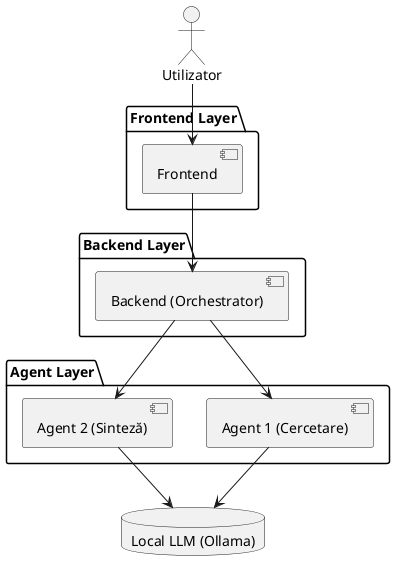
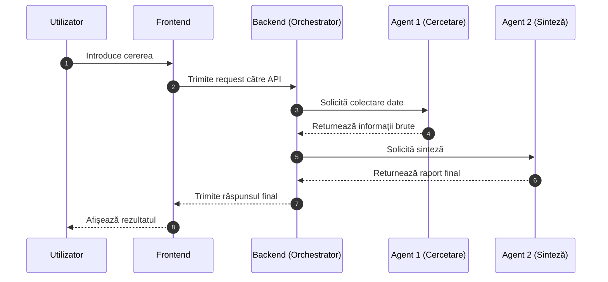

# 📐 System Architecture

## 🧱 UML Component Diagram

---

## 🔄 Agent Workflow Diagram

---

## 📝 Notes

> Diagrams generated with AI assistance (ChatGPT + Mermaid / PlantUML).  
> PlantUML diagram may require a compatible viewer (e.g. VS Code extension or PlantUML renderer).

