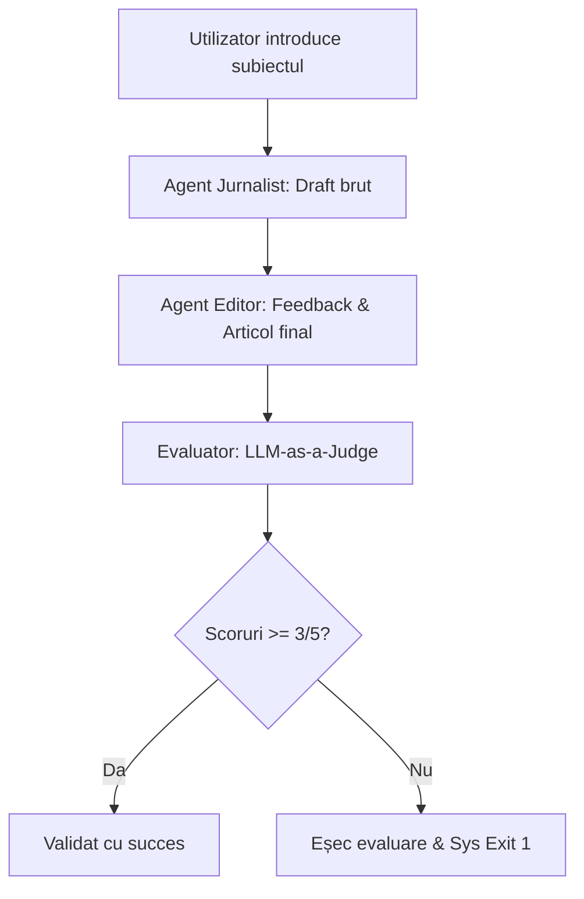

# 🧪 Metodologia de Evaluare: LLM-as-a-Judge (G-Eval)

Acest document descrie fundamentul academic și detaliile de implementare pentru sistemul de evaluare automată a calității articolelor din cadrul proiectului **AI-Newsroom**.

---

## 📖 1. Fundamente Teoretice

În mod tradițional, evaluarea textelor generate prin sisteme de Natural Language Generation (NLG) se baza pe metrici lexicale precum:
* **BLEU (Bilingual Evaluation Understudy)**: Măsoară precizia n-gramelor între textul generat și referințe. Folosit în principal în traduceri.
* **ROUGE (Recall-Oriented Understudy for Gisting Evaluation)**: Măsoară gradul de acoperire al n-gramelor (recall). Folosit în principal în rezumate.

### ⚠️ Limitarea Metricilor Clasice
Metricile bazate exclusiv pe suprapunerea lexicală (BLEU, ROUGE) suferă de o mare problemă: **nu înțeleg semantica**. Dacă un model generează o propoziție corectă și coerentă folosind sinonime sau reformulări care nu apar în textul de referință, metricile clasice o vor penaliza cu un scor foarte mic, deși calitatea umană percepută este maximă.

### 🌟 Soluția Modernă: G-Eval (LLM-as-a-Judge)
Inspirat din lucrarea academică **"G-Eval: NLG Evaluation using GPT-4 with Better Human Alignment"** *(Liu et al., 2023, arXiv:2303.16634)*, proiectul utilizează un model de limbaj (LLM) ca judecător automat. 

Cercetările arată că LLM-urile puternice, atunci când sunt ghidate de instrucțiuni de evaluare (prompts) precise și formulează o justificare rațională înainte de a acorda o notă, prezintă o **corelație mult mai mare cu evaluarea umană** comparativ cu BLEU sau ROUGE.

---

## 📐 2. Criterii de Evaluare Implementate

Evaluatorul nostru analizează articolul generat pe baza a două dimensiuni calitative adaptate din standardele de evaluare academică:

### A. Coerență (Coherence)
* **Definiție**: Măsura în care textul final este bine structurat, ușor de citit, organizat logic și lipsit de contradicții interne sau fraze repetitive.
* **Scară de notare**: 1-5 (1 = text indescifrabil/haotic; 5 = articol cursiv, perfect organizat în Markdown).

### B. Relevanță (Relevance)
* **Definiție**: Măsura în care articolul final acoperă fidel subiectul și ideile cheie prezente în draftul inițial propus de Jurnalist, fără a introduce detalii inutile sau complet divergente.
* **Scară de notare**: 1-5 (1 = complet irelevant; 5 = acoperire totală și fidelă).

---

## 🛠️ 3. Implementarea Tehnică

Procesul este implementat în scriptul [scripts/ai_evals.py](file:///c:/Users/noemi/Desktop/MDS/AI-Newsroom/scripts/ai_evals.py):



1. **Promptul Evaluatorului**: Ghidează LLM-ul să joace rolul unui arbitru obiectiv și îl forțează să returneze un format strict JSON conținând `coherence_score`, `relevance_score` și `reasoning`.
2. **Modul CI (Continuous Integration)**: Pentru a fi integrat în GitHub Actions fără a depinde de o instanță activă de Ollama în cloud, scriptul detectează mediul (`CI=true`) și simulează un răspuns valid al judecătorului.
3. **Local**: Apelează API-ul `/ask` al aplicației FastAPI, delegând evaluarea către modelul `mistral` din Ollama.

---

## 🎓 4. Ghid de Apărare a Proiectului (Q&A pentru Profesor)

În timpul prezentării sau apărării proiectului, s-ar putea să primești întrebări de la profesori sau colegi. Iată răspunsurile cheie pregătite:

### Q1: "De ce ai folosit LLM-as-a-Judge în loc de metrici standard ca BLEU/ROUGE?"
> **Răspuns**: Metricile lexicale precum BLEU și ROUGE caută suprapuneri literale de cuvinte. În cazul generării de articole de știri, un editor poate rescrie complet un paragraf pentru a fi mai fluid semantic, păstrând în același timp ideea. BLEU ar da un scor de 0% pentru că nu s-au potrivit cuvintele. G-Eval, pe de altă parte, înțelege sensul textului și evaluează coerența și relevanța din punct de vedere semantic, având o corelație demonstrată statistic mult mai apropiată de evaluarea realizată de profesioniști umani.

### Q2: "Nu există un risc de bias/auto-evaluare dacă același LLM (Mistral) a generat textul și tot el îl evaluează?"
> **Răspuns**: Într-adevăr, în literatura de specialitate (ex: *Zheng et al., 2023*) este documentat fenomenul de "self-enhancement bias" (LLM-urile tind să dea note mai mari textelor generate de ele însele). Pentru a reduce acest bias, am implementat:
> 1. Roluri complet distincte prin prompts de sistem (Editorul este instruit să fie critic, iar Judecătorul este complet neutru).
> 2. O scară de evaluare granulată cu criterii specifice (nu doar o notă generală).
> 3. Pe viitor sau într-un mediu de producție, judecătorul poate fi un model mai mare și complet diferit (de exemplu, un model open-source specializat în evaluări, precum Prometheus, sau GPT-4 prin API).

### Q3: "Cum asiguri stabilitatea output-ului (JSON) de la LLM-ul judecător?"
> **Răspuns**: În `EVALUATOR_SYSTEM_PROMPT` am impus reguli foarte stricte privind formatul de ieșire (JSON). În plus, în codul Python am implementat o logică de curățare a blocurilor de cod Markdown (` ```json ` și ` ``` `) și blocuri de tip `try-except` care previn prăbușirea sistemului în caz de eroare de parsare, mapând erorile pe un scor implicit de `0` pentru a semnala un test eșuat.

### Q4: "Ce se întâmplă dacă evaluarea eșuează în pipeline?"
> **Răspuns**: Dacă scorul de coerență sau relevanță scade sub pragul minim acceptabil de `3/5`, scriptul se termină cu codul de ieșire `1`. În pipeline-ul CI/CD din GitHub Actions, acest lucru va bloca automat îmbinarea codului (Pull Request), asigurându-ne că nicio schimbare de cod nu degradează calitatea textelor generate de agenți.
